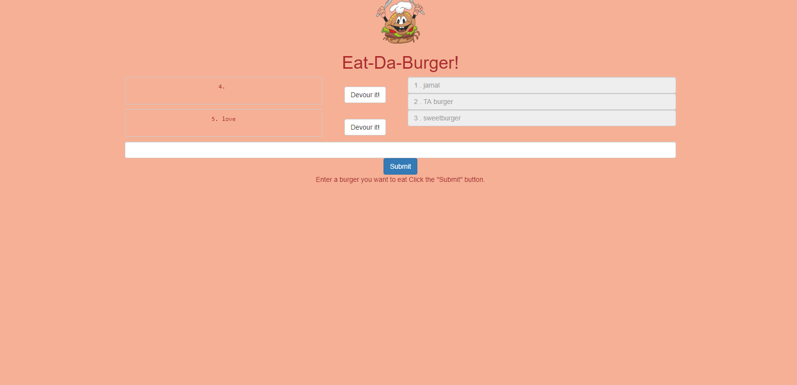

# Node Express Handlebars

### Overview

This app will allow the user to create a burger logger with MySQL, Node, Express, Handlebars and a homemade ORM (yum!). Be sure to follow the MVC design pattern; use Node and MySQL to query and route data in your app, and Handlebars to generate your HTML.

### Concepts Used 

* Model-View-Controller (MVC)
* Object Relational Mapping (ORM)
* Express.js
* HTTP Requests (GET, POST,PUT,DELETE)
* Routes and static content
* Handlebars engine integration
* Node.js
* Backend API calls
* Handlebars Templates and Layouts
* MySQL

### Deployment 

This app is deployed on heroku at https://burger-sql.herokuapp.com/

### Screenshot 

 